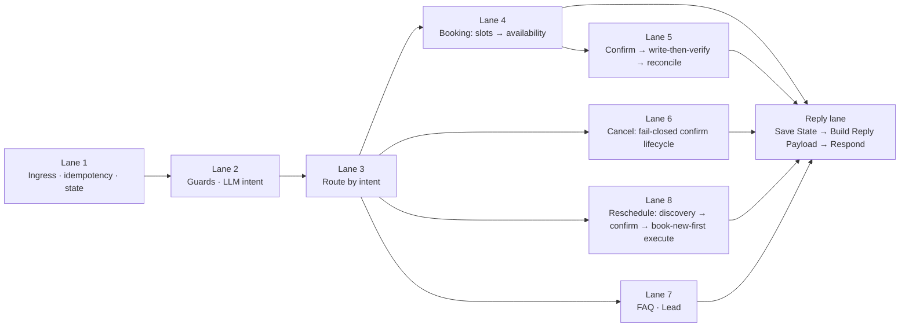
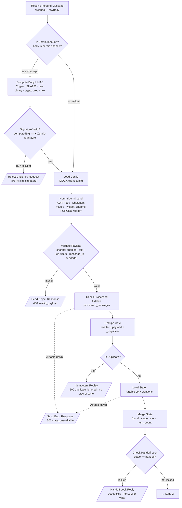
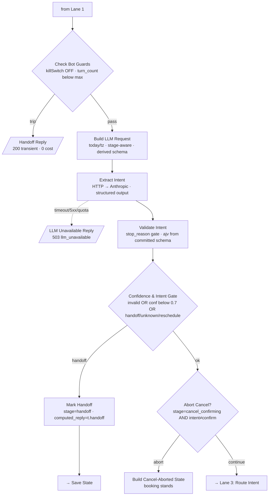
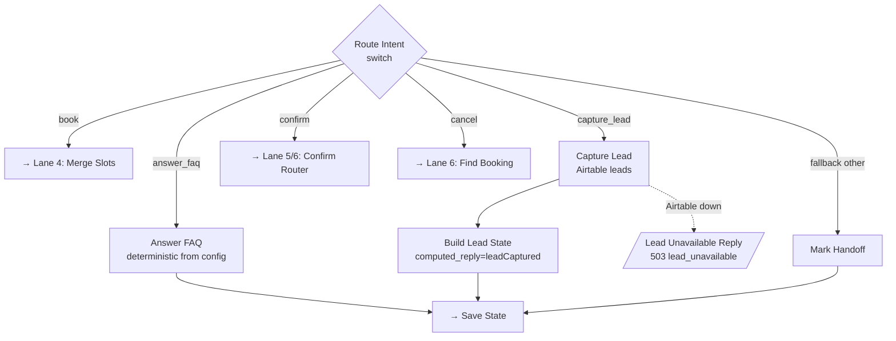
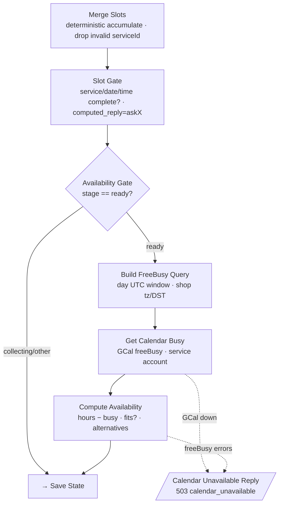
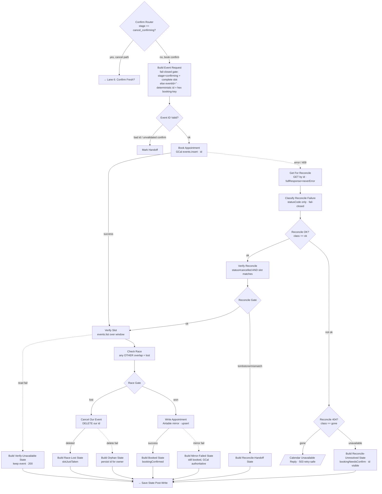
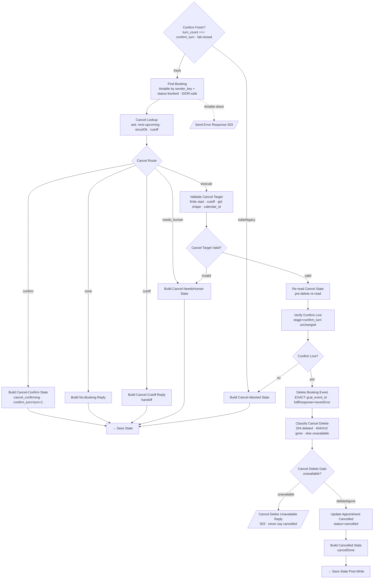

# Flow diagram — Salon Booking Bot (n8n `Salon Booking Bot — Main`)

> **Role of this file:** the teaching map of the engine — lane by lane, the **main path** (solid arrows)
> and every **error / handoff path** (dashed). Node names match the n8n canvas exactly, so you can point at
> a box here and find it there. The authoritative graph is the workflow itself; this is the readable view.
>
> **How to read it.** Solid arrow = happy path. Dashed arrow = an error / branch / handoff exit. Every
> external call (Anthropic, Google Calendar, Airtable) has a **visible** error exit — silent failure is
> forbidden ([n8n-conventions](../.claude/rules/n8n-conventions.md)). The three handoff classes never merge
> ([handoff.md](../.claude/rules/handoff.md)): **guard-trip** (200, transient, no state write) ·
> **infra-unavailable** (5xx + `error` flag) · **intent-handoff** (200, writes `stage=handoff`).

## Overview — the lanes



Everything converges on **one** reply lane: a builder sets `computed_reply`, a **Save State** persists it
(always, via `|| ''`), and **Build Reply Payload** reads it back from the `computed_reply` column
(Refactor #5). See the Reply lane at the end.

---

## Lane 1 — Ingress · idempotency · state load



**Signature gate (CP4a · CRT #3):** a Zernio-shaped inbound must carry a valid `X-Zernio-Signature`
(HMAC-SHA256 lowercase-hex of the raw body, secret in a `crypto` credential) — wrong/missing → **403**
`invalid_signature`, the brain never runs. Widget skips the gate (no shared secret; Phase-5 rate-limit).
**Adapter + IDOR guard (CP4a):** `Normalize Inbound` is the single channel adapter; its widget branch FORCES
`channel='widget'` (never trusts a payload channel) so the ONLY path to a `whatsapp:` sender_key is a signed
Zernio message — closing an IDOR where a forged `{channel:'whatsapp', from:<victim>}` would impersonate a customer.
**Main path:** every message is validated, deduped on `message_id` (a webhook delivered twice → one effect),
loaded into conversation state, and — if a human already took over (`stage=handoff`) — the bot stays silent.
**Error paths (all visible):** unsigned/forged Zernio → **403** `invalid_signature`; bad payload → **400**; Airtable unreachable → **503** `state_unavailable`;
duplicate → short-circuit **200** `duplicate_ignored` (no LLM cost, no write); locked thread → **200**
`Handoff Lock Reply` (bot quiet, `turn_count` frozen).

---

## Lane 2 — Guards (before the LLM) · LLM intent · validate · gate



**Deterministic-before-AI:** guards run with **zero** LLM cost. The LLM ONLY classifies intent + slots; every
downstream action is deterministic IF/Switch/Code. **Three handoff classes are already distinct here:**
guard-trip (`Handoff Reply`, 200, writes no state) · infra (`LLM Unavailable Reply`, 503) · intent-handoff
(`Mark Handoff`, 200, writes `stage=handoff`). **Abort Cancel?** catches "user said something other than yes
while a cancel is awaiting confirmation" → the pending cancel is dropped (booking stands).

---

## Lane 3 — Route by intent



`confirm` is disambiguated by **stage** upstream: on a `cancel_confirming` thread it means "yes, cancel";
otherwise it means "yes, book". FAQ answers are **deterministic** config lookups (never an LLM-authored
answer). Lead-write has its **own** 503 (`lead_unavailable`), distinct from `state_unavailable`, so an owner
alert can tell them apart.

---

## Lane 4 — Booking: slot-filling → availability (read-only)



Multi-turn slot-fill accumulates deterministically (a mid-booking FAQ never wipes stored slots). When slots
are complete the bot checks the **real** calendar (`freeBusy`, no event-detail leak) **before** confirming —
available → `stage=confirming` + a confirm ask; busy → alternatives; closed/past → re-ask. GCal down or a
`freeBusy` `errors` payload → **503** (never a false "available"). **No write yet** — the write is Lane 5.
**Rejected-slot clear (fail-closed):** every non-available status (`closed`/`past`/`invalid`/`busy`) CLEARS the
rejected slot from state (invalid/past drop date+time; closed/busy keep the open date, drop the time), so a
later stray "yes" has no bookable slot — paired with the Lane 5 booking-confirm gate.

---

## Lane 5 — Confirm → write-then-verify → reconcile (no-double-book)



**Write-then-verify** is the no-double-book guard: after our insert we re-read the window; any OTHER
overlapping event → we delete **our own** event (never a pre-existing one) and hand off. Best-effort, not an
atomic lock (documented limits in ARCH-DEC §5). **Insert-idempotency:** a deterministic event id makes a
duplicate insert **409**; the reconcile sub-lane (`Get For Reconcile` → `Classify Reconcile Failure`
statusCode-only, fail-closed → `Reconcile OK?`/`Reconcile 404?`) decides safely — **ok** reconciles to the
existing event (no 2nd booking), **gone** → 503 retry-safe, **unavailable** → `Build Reconcile-Unresolved
State` (its specific message reaches the customer via the reply column — Refactor #5 F1 fix). All post-write
builders go to **Save State (Post-Write)**.

---

## Lane 6 — Cancel: fail-closed confirm lifecycle



Identity is the channel-auth **`sender_key`**, never a customer-supplied id → **IDOR is structurally
impossible**. A "yes" DELETES a real event, so the confirm lifecycle is **fail-closed** (see the canvas
sticky): **Confirm Router** (is this a cancel-confirm thread?) → **Confirm Fresh?** (1-turn TTL, validate
before you coerce) → **Validate Cancel Target** (the structural gate before any delete) → **Confirm Live?**
(pre-delete re-read narrows the race). Delete failure (5xx) → **503**, never "cancelled". The three gates and
the two duplicated validators (`Cancel Lookup` structOk + `Validate Cancel Target`) are held in sync by
`scripts/check-cancel-validation-parity.py` (Refactor #4).

---

## Lane 8 — Reschedule: discovery + fail-closed confirm (CP4)

```mermaid
flowchart TD
  RIR[Route Intent · reschedule] --> FBR[Find Booking (Reschedule)<br/>Airtable by sender_key + booked · IDOR-safe]
  FBR -.->|Airtable down| ERR[/Send Error Response 503/]
  FBR --> RL[Reschedule Lookup<br/>next-upcoming · structOk · cutoff · read NEW slot from LLM]
  RL --> RCH{Reschedule Check?}
  RCH --> BRF[Build Reschedule FreeBusy] --> GRB[Get Reschedule Busy<br/>GCal freeBusy]
  GRB --> CRA[Compute Reschedule Availability]
  CRA -->|available| ASK[stage=reschedule_confirming<br/>confirm-ask · confirm_turn · cancel_target_id=OLD recordId]
  CRA -.->|busy / past / closed / invalid / no-booking| HO[handoff with context]
  ASK --> SS[→ Save State]
  HO --> SS

  CR{Confirm Router · cancel_confirming?} -->|no| RR{Reschedule Router · reschedule_confirming?}
  RR -->|no| BER[→ Lane 5: Build Event Request · book confirm]
  RR -->|yes| RF{Reschedule Fresh?<br/>turn_count === confirm_turn · byte-identical to Confirm Fresh?}
  RF -.->|stale / legacy| BRA[Build Reschedule-Aborted State<br/>booking stays]
  RF -->|fresh| EX[→ Lane 8b: EXECUTE]
  BRA --> SS
```

The reschedule confirm lifecycle mirrors cancel exactly: its own **`Reschedule Fresh?`** 1-turn TTL gate
(byte-identical to `Confirm Fresh?`, enforced by `check-cancel-validation-parity.py`), and **`Abort
Reschedule?`** (Lane 2) drops a pending reschedule if a non-confirm intent arrives. Every non-available
discovery outcome hands off with context — the availability rules are the booking rules (no min-lead-time,
ARCH-DEC §5).

## Lane 8b — Reschedule EXECUTE: book-new-first → verify/race → commit

```mermaid
flowchart TD
  EX[from Reschedule Fresh? · fresh] --> FOB[Find Old Booking (Reschedule)<br/>Validate Intent sender_key · booked]
  FOB -.->|Airtable down| ERR[/Send Error Response 503/]
  FOB --> VRT[Validate Reschedule Target<br/>bind cancel_target_id · structOk · cutoff]
  VRT --> RTV{Reschedule Target Valid?}
  RTV -.->|false| BNH[Build Reschedule-NeedsHuman State<br/>NO insert · NO delete]
  RTV -->|true| BREQ["Build Reschedule Event Request<br/>NEW slot · new deterministic id · ...$json keeps _reschedule_target"]
  BREQ --> BK[Book Reschedule Appointment<br/>GCal insert the NEW event]
  BK -.->|error / 409| BIF[[Build Reschedule Insert-Failed State<br/>original stands · book-new-first = old intact]]
  BK -->|success| VSR[Verify Slot (Reschedule)<br/>events.list over the NEW window]
  VSR -.->|read fail| BVU[Build Reschedule Verify-Unavailable State<br/>NEW kept · OLD intact · never delete on unverified read]
  VSR --> CRR[Check Race (Reschedule)<br/>drop cancelled+transparent+OUR new id · any OTHER overlap = lost]
  CRR --> RGR{Race Gate (Reschedule)}
  RGR -.->|lost| CNE[Cancel New Event (Reschedule)<br/>DELETE OUR new event only]
  CNE -->|deleted| BRL[[Build Reschedule Race-Lost State<br/>slotJustTaken · OLD intact]]
  CNE -.->|delete fail| BRO[Build Reschedule Race-Orphan State<br/>orphan_event]
  RGR -->|won| UAR[Update Appointment (Reschedule)<br/>row → NEW event · FIRST]
  UAR -.->|mirror fail| BMF[[Build Reschedule Mirror-Failed State<br/>NEW exists · row stale · reschedule_mirror_failed]]
  UAR --> DOE[Delete Old Event (Reschedule)<br/>DELETE OLD · SECOND · fullResponse+neverError · both outputs → Classify]
  DOE --> CRD[Classify Reschedule Delete<br/>statusCode ONLY: 204/200 done · 404/410 gone · else unavailable]
  CRD --> RDG{Reschedule Delete Gate · unavailable?}
  RDG -.->|unavailable| BORP[[Build Reschedule Orphan State<br/>OLD lingers · reschedule_orphan · honest 'moved']]
  RDG -->|done/gone| BRD[Build Reschedule-Done State<br/>stage=booked · new gcal id · rescheduleDone]
  BNH --> SS[→ Save State]
  BIF --> SPW[→ Save State Post-Write]
  BVU --> SPW
  BRL --> SPW
  BRO --> SPW
  BMF --> SPW
  BORP --> SPW
  BRD --> SPW
```

**Book-new-first** is the core invariant: open the NEW booking, verify it, win the race, THEN commit — so at
every intermediate failure point the customer still holds a valid booking. **Order within the commit is
mandatory: `Update Appointment (Reschedule)` (row → NEW event) runs BEFORE `Delete Old Event (Reschedule)`**,
so the row always references a real, existing event (and Delete reads the OLD target from the `Build
Reschedule Event Request` node-ref, because the Airtable update already replaced `$json`). Classify is
**statusCode-only** (a 404 = the OLD event already gone = a *successful* move, never a "couldn't move"). The
three named failure branches: **insert-failed** (NEW insert fails → original stands, no reconcile — message
dedup + book-new-first make it safe) · **race-lost** (another booking took the NEW slot → delete OUR new
event, OLD untouched) · **orphan / mirror-failed** (the move succeeded but a mirror step is inconsistent →
handoff with a visible owner flag; the customer is told the truth). Every failure builder sets
`computed_reply` and routes to **Save State (Post-Write)** — never a silent drop.

---

## Reply lane — one exit for every conversational reply

```mermaid
flowchart TD
  SS[Save State<br/>upsert · turn_count+1 · computed_reply via '||'] --> BRP[Build Reply Payload<br/>ADDITIVE: read computed_reply column]
  SPW[Save State Post-Write] --> BRP
  SS -.->|Airtable down| ERR[/Send Error Response 503/]
  SPW -.->|Airtable down| BSU[/Booking State-Unsaved Reply<br/>200 · reply kept/]
  SS --> RP[Record Processed<br/>message_id · AFTER success]
  SPW --> RP
  BRP --> SRO[/Send Reply To Origin<br/>200 reply/]
```

Two Save States (pre-write on the conversational path, post-write after a booking/cancel), both **always**
write `computed_reply` (`|| ''` — a turn with no reply CLEARS it, so the reader can never replay a previous
turn). **Build Reply Payload** is a thin reader: `computed_reply` from the column if present (greet only on
`collecting`), otherwise the original per-intent fallback, and a machine-visible `reply_fallback` flag if even
that is empty (Refactor #5). `Record Processed` writes the `message_id` **after** a successful Save State, so a
transient-failure retry is not blocked.

**Outbound convergence (CP4b-1) + 5xx/ACK policy (CP4b-3).** All 11 reply branches (the conversational reply +
the 400/503/guard/duplicate/lock exits) now tag `_outbound_status`/`_outbound_body` (their VERBATIM response) →
**Finalize Outbound** → **Channel Switch**, which splits the ONE transport by channel:

- **widget** → `Send Reply (widget)` — **synchronous**, byte-identical to the pre-convergence nodes:
  `responseBody:{{_outbound_body}}`, `responseCode:{{_outbound_status}}`. Widget **keeps its real status codes**
  (200/400/503) — the browser reads them.
- **whatsapp** → `Respond ACK 200 (whatsapp)` **[first, always 200]** → `Should Send?` → `Send WhatsApp (Zernio)`
  (`POST /v1/inbox/conversations/{conversationId}/messages`, `{accountId, message}`) → on error `Outbound Send
  Failed` (visible, `error:'zernio_send_failed'` + `_outbound_owner_flag`).

**The whatsapp policy (formalized CP4b-3), three standing rules:**
1. **whatsapp NEVER returns 5xx** — the ACK is hardcoded 200 and **independent of `_outbound_status`**; a
   400/503-class conversational outcome still ACKs 200 + sends the polite reply. A 5xx would make the provider
   retry the inbound = a resend storm.
2. **ACK precedes the send** — the 200 is emitted BEFORE the Zernio call, so a slow send can't push the webhook
   past the provider timeout (which would also trigger a resend). Gated empirically: n8n continues after
   `respondToWebhook` (exec 996). The send's own failure only flags `Outbound Send Failed`, still 200.
3. **Send only if the customer must learn something new** — `_outbound_should_send` is a rule, not a list;
   duplicate (already replied) + handoff-lock (already told) = no send.

`Reject Unsigned Request` (403) is the one exit that stays **SEPARATE** — never converged, so a forged
`conversationId` can't be turned into a message-trigger primitive against an arbitrary number.

---

## Owner-alert lane — every failure/handoff reaches a human (CP5a)
A single fan-in, deliberately OFF the reply path so it can never block or change the customer reply
(**D-c invariant**). Every failure/handoff source adds ONE extra edge to `Build Owner Alert`:

```
<any source: Mark Handoff · Handoff Lock Reply · Build *Orphan/Mirror/Verify/Reconcile* State ·
 Cancel/Reschedule needs-human · infra-503 replies · Outbound Send Failed · Handoff Reply (guard) ·
 Build Reply Payload (reply_fallback)>
        │  (additional edge; the source's own reply/state path is untouched)
        ▼
  Build Owner Alert   ── derive class · enabled-gate · THROTTLE(class:sender, window=config) ──▶ [] (suppress)
        │  (alert-worthy & not throttled & not kill-switch-guard-trip)
        ▼
  Send Owner Alert (Telegram)  ──(onError)──▶  Owner Alert Failed  (visible; reply already sent)
```
- **One place** classifies + throttles (KK1): `class:sender` key, window `config.ownerAlert.throttleMinutes`,
  via `$getWorkflowStaticData` — a repeated same-fault storm pings once per window.
- **KK2:** a guard-trip pings for **max-turns** only; a **kill-switch** trip is owner-initiated → suppressed.
- **KK3:** race-lost is a normal "slot taken" outcome → not alerted (orphan IS).
- **Context (D-a):** the alert carries the rolling last-5 `conversations.recent_messages` (PII).
- **Reminders workflow** has its own `Build Owner Alert (Reminders)` → Telegram off `Reminder Error`.
- Chat id + bot token live in the `telegram` credential / `$env` / gitignored env — never in git.

---

## The invariants this diagram encodes (why the shapes are what they are)
- **Deterministic before AI** — the LLM only classifies; every action is IF/Switch/Code.
- **Every external call has a visible error exit** — 400 / 503 with an `error` flag, never a silent failure.
- **Three handoff classes never merge** — guard-trip (200) · infra (5xx) · intent-handoff (200, writes state).
- **Zero double-book** — idempotency (dedupe + deterministic event id) + write-then-verify.
- **Fail-closed cancel** — a "yes" deletes a real event, so every cancel gate defaults to "do nothing".
- **Book-new-first reschedule** — open + verify the NEW booking before touching the OLD one; commit is
  update-row-then-delete-old; every intermediate failure leaves the customer on a valid booking.
- **One reply source** — `computed_reply` column, guarded by two drift-guards (#4, #5).
